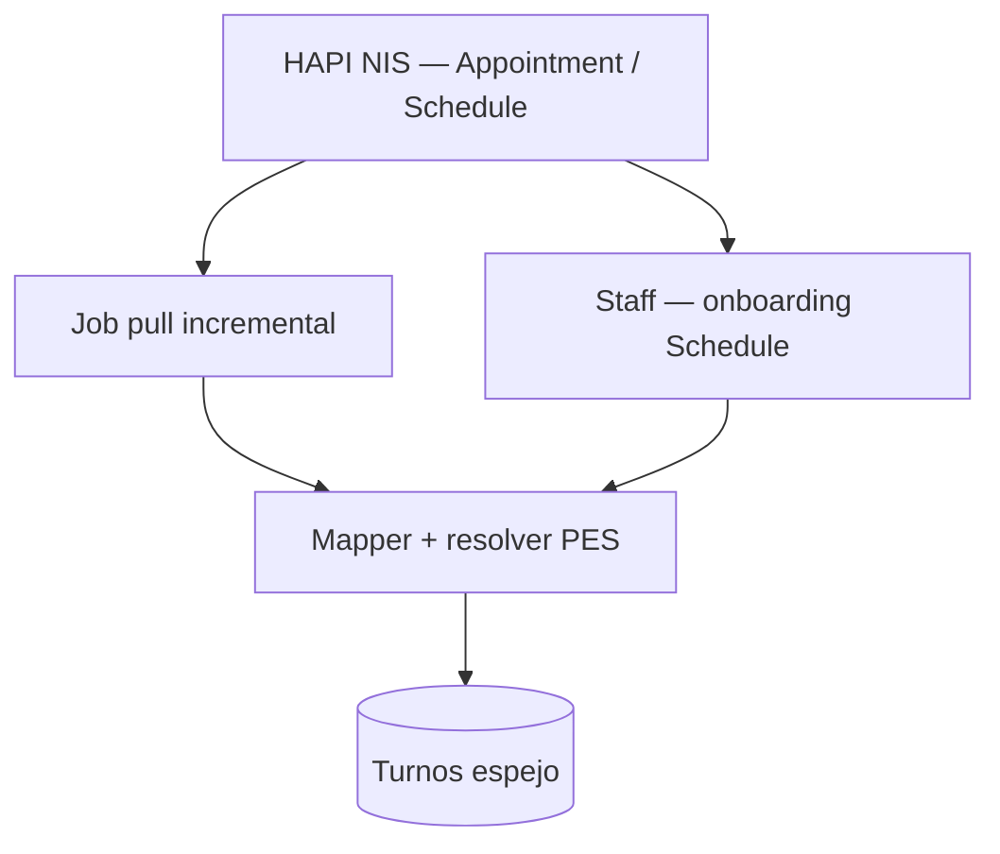

# Interoperabilidad — agendamiento FHIR (NIS MSAL)

## De qué se trata

Bioenlace puede **consumir** agendas y citas publicadas en un servidor **HAPI FHIR** externo — hoy el [NIS MSAL](https://nis.msalsgo.gob.ar/fhir) — y mantener un **espejo operativo** en la tabla `turnos`. Cuando el estado de una cita cambia en Bioenlace (cancelación, atención, ausencia), el sistema puede **devolver** ese estado al servidor FHIR (`Appointment.status`).

Bioenlace **no publica** su propia grilla (`Slot` / `Schedule`) en esta fase: la fuente de verdad de cupos sigue siendo el sistema nacional; Bioenlace refleja y opera sobre las citas ya agendadas allí.

## Actores

| Actor | Rol |
|-------|-----|
| **Administración del efector / RRHH** | Mapea códigos de servicio FHIR, vincula cada `Schedule` HAPI con un PES local (profesional + efector + servicio) |
| **Profesional y staff** | Ven y gestionan turnos espejo como cualquier otro turno (cancelar, marcar atendido, etc.) |
| **Paciente** | Puede figurar en la cita si NIS trae identificador DNI/CUIL reconocible; si no, el turno espejo puede existir sin `id_persona` hasta vincularlo |
| **Operaciones** | Activa la integración, programa crons de pull/push, revisa logs ante fallos |
| **NIS / MSAL** | Publica `Schedule`, `Slot` y `Appointment`; recibe actualizaciones de estado salientes |

## Ancla operativa: PES

Cada agenda FHIR (`Schedule`) debe corresponder a un **PES** (`profesional_efector_servicio`) en Bioenlace. Sin PES confiable no se asignan cupos clínicos locales ni flujos que dependan del profesional.

La confianza no se infiere “a ojo”: hay un **catálogo verificado** (`integration_schedule_link`) que el staff confirma una vez, más un resolver automático fail-closed (CUIL + SISA + código de servicio) para proponer candidatos.

## Cómo funciona (entrante)

1. **Preparación (una vez por agenda):** el staff mapea el código `HealthcareService` del efector al `id_servicio` Bioenlace y **confirma el vínculo** Schedule HAPI → PES (pantalla de preview + confirmación).
2. **Pull:** un cron consulta `Appointment` modificados desde el último cursor (`_lastUpdated`) y crea o actualiza turnos espejo (`external_appointment_id`, `fhir_status`, fecha/hora, paciente si se resuelve).
3. **Confianza PES:** cada turno guarda `pes_resolution_trust`:
   - `verified` — link confirmado y actores FHIR coherentes → PES asignado.
   - `provisional` — candidato único sin confirmación humana → espejo sin operar como agenda clínica plena.
   - `unresolved` / `stale` — sin PES automático; requiere revisión staff.

## Cómo funciona (saliente)

Cuando un turno espejo cambia de estado en Bioenlace, el sistema publica el equivalente FHIR en NIS (si la integración saliente está habilitada):

| Estado Bioenlace | `Appointment.status` |
|------------------|----------------------|
| Pendiente / en resolución | `booked` |
| En atención | `arrived` |
| Atendido | `fulfilled` |
| Cancelado | `cancelled` |
| Sin atender (no-show) | `noshow` |

Los cambios originados por el **pull entrante** no disparan push (evita bucles). Un job de **reintento** cubre fallos de red en tiempo real.

## Identificación sin identificador Bioenlace en HAPI

NIS no incluirá `urn:bioenlace:pes`. El matching usa perfil nacional mínimo:

| Recurso FHIR | Dato Bioenlace |
|--------------|----------------|
| `Location` / efector | `Efector.codigo_sisa` |
| `Practitioner` | `Persona.cuil` (preferido) o DNI |
| `HealthcareService` | Catálogo `integration_fhir_service_code` |
| `Schedule` | Catálogo `integration_schedule_link` → PES |

Alta de PES clínico exige **CUIL** del profesional (salvo servicio administrativo del efector), alineado con export FHIR de historia clínica.

## Superficies staff

| Acción | Dónde |
|--------|--------|
| Mapear código servicio FHIR → servicio local | API `listar-codigos-servicio-fhir` / `guardar-codigo-servicio-fhir` |
| Listar agendas HAPI del efector | API `listar-schedules-hapi` |
| Preview actores + PES candidato | API `preview-vinculo-schedule-hapi` (UI JSON) |
| Confirmar vínculo Schedule → PES | API `confirmar-vinculo-schedule-hapi` |

Requiere permisos RBAC de gestión de PES / integración FHIR scheduling.

## Modos de operación

| Modo | Comportamiento |
|------|----------------|
| **Apagado** | Sin pull ni push (`fhirSchedulingInbound.enabled = false`) — comportamiento por defecto |
| **Solo entrante** | Pull y espejo local; sin publicar estados a NIS |
| **Bidireccional** | Entrante + `outbound.enabled` — cancelaciones y cierres en Bioenlace actualizan NIS |

OAuth hacia NIS es opcional y se configura por entorno cuando MSAL lo exija.

## Operación habitual

| Tarea | Frecuencia sugerida |
|-------|---------------------|
| Pull incremental de citas | Cada 10–15 min |
| Push saliente (reintento) | Cada hora |
| Reconciliación links `stale` | Diaria |

Comandos de consola: `fhir-scheduling-inbound/pull`, `push-outbound`, `reconcile-schedule-links`. Logs: categorías `fhir-scheduling-inbound` y `fhir-scheduling-outbound`.

## Qué no hace hoy

- Publicar grilla propia (`Slot` / `Schedule`) hacia NIS.
- Sustituir la reserva paciente nativa de Bioenlace cuando el efector no usa NIS como fuente de cupos.
- Garantizar paciente local en todo turno entrante (puede faltar hasta tener DNI/CUIL en ambos lados).
- Homologación cerrada sin datos reales en NIS (piloto pendiente de citas de prueba en el servidor).

## Relación con el resto

| Tema | Documento |
|------|-----------|
| Turnos nativos (reserva, resolución, agentes) | [turnos.md](./turnos.md) |
| Export FHIR de atención finalizada | [interoperabilidad-historia-clinica.md](./interoperabilidad-historia-clinica.md) |
| CUIL y alta de profesional (PES) | Flujo asistente `profesional-efector-servicio.crear-flow` |
| Madurez agenda | [his-completo/11-agenda-turnos.md](../his-completo/11-agenda-turnos.md) |

Referencia técnica del módulo: `common/components/Domain/Integrations/Scheduling/README.md`.
