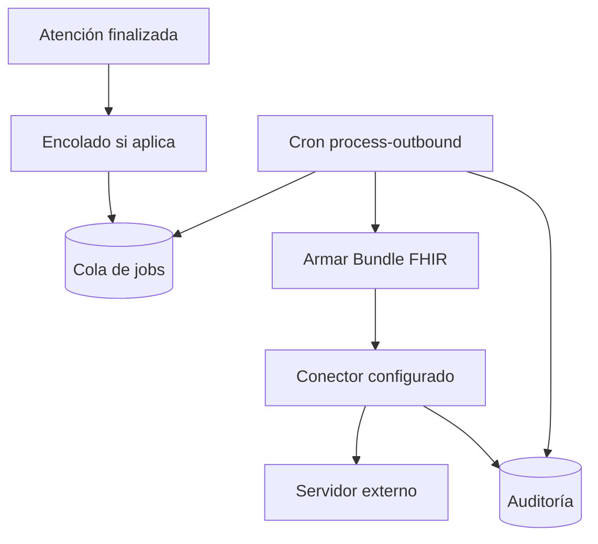

# Interoperabilidad — export de historia clínica (FHIR)

## De qué se trata

Cuando una **atención queda finalizada**, Bioenlace puede **exportar** la documentación clínica de ese encuentro como un **paquete FHIR** (Bundle documental) hacia una **red de salud o servidor gubernamental**. El envío es **asíncrono**: se encola, se reintenta ante fallos transitorios y queda **auditado**.

No reemplaza el expediente legal PDF ni el resumen al paciente: es un circuito **saliente** de interoperabilidad, configurable por institución.

## Actores

| Actor | Rol |
|-------|-----|
| **Profesional / API clínica** | Finaliza el encounter; eso dispara la cola si la export está habilitada |
| **Operaciones** | Activa parámetros, programa crons, revisa jobs fallidos o sin acuse |
| **Receptor nacional / red** | Recibe el Bundle, devuelve identificador de aceptación o error normativo |
| **Staff con permiso** | Consulta estado de export por atención o por job (API staff) |

## Cómo funciona (finalizar → enviar)

1. **Disparo:** al pasar el encounter a estado finalizado, el sistema evalúa si la export está activa y si la clase de atención (ambulatoria, guardia, internación, según configuración) entra en el alcance.
2. **Encolado:** se crea o actualiza un **job** con demora breve (por defecto unos minutos) para dejar estable la nota clínica antes del armado del paquete.
3. **Procesamiento:** un cron toma jobs vencidos, construye el **Bundle documental** (paciente, encuentro, nota, diagnósticos, pedidos, medicación, alergias activas, laboratorio vinculado, recetas emitidas) e invoca el **conector** configurado.
4. **Resultado:** el job queda en estado enviado, omitido (sin conector real), fallido (reintento) o muerto (intervención manual). Cada transición se registra en auditoría y en `agent_run` (agente E02).
5. **Acuse:** si el receptor no devuelve identificador en línea, un cron de **conciliación** puede consultar estado cuando exista endpoint de polling acordado.

## Contenido del paquete (perfil interno v1)

El paquete agrupa, entre otros:

| Contenido clínico | Origen en Bioenlace |
|-------------------|---------------------|
| Paciente | Persona del encounter |
| Encuentro | Atención finalizada |
| Nota / composición | Evolución, motivo, secciones estructuradas |
| Diagnósticos | Condiciones del encounter |
| Medicación y pedidos | Órdenes vinculadas a la atención |
| Alergias | Subconjunto activo del paciente |
| Laboratorio | Informes ligados al encounter o al paciente |
| Recetas emitidas | Documentos de receta electrónica ya emitidos |

El **perfil nacional exacto** (StructureDefinition, identificadores REFES/CUIL, etc.) depende del contrato con MSAL o la red jurisdiccional; hoy el armado es válido como paquete interno y base de homologación.

## Modos de operación

| Modo | Comportamiento |
|------|----------------|
| **Apagado** | Sin cola ni envío (comportamiento por defecto) |
| **Dry-run** | Encola y arma el Bundle; conector nulo marca el job como **omitido** — útil para probar el mapper |
| **Nacional** | Conector HTTP con OAuth y POST al servidor acordado; requiere credenciales en configuración de servidor |

Filtros opcionales por **efector** (lista permitida o excluida) para pilotos graduales.

## Estados del job

| Estado | Significado |
|--------|-------------|
| Pendiente | En cola, esperando `run_at` o procesamiento |
| Procesando | El worker está armando o enviando |
| Enviado | El conector reportó éxito |
| Omitido | Sin envío real (conector nulo o regla de negocio) |
| Fallido | Error transitorio; se reintenta con espera creciente |
| Muerto | Agotados reintentos; requiere reencolar o soporte |

La auditoría puede registrar además eventos de **reconciliación** cuando se obtiene un identificador externo tardío.

## Reintentos y operación

- Reintentos automáticos ante timeout, errores 5xx o rate limit; errores de validación 4xx suelen marcar el job como muerto de inmediato.
- Comandos de consola habituales: procesar cola, procesar un job, reencolar muerto/fallido, conciliar acuses.
- Frecuencia sugerida: cola cada pocos minutos; conciliación diaria si hay endpoint de estado.

## Consulta staff

| Acción | API v1 |
|--------|--------|
| Listar exports de un encounter | `GET /api/v1/clinical/history-exchange/listar-por-encounter?encounter_id=` |
| Ver estado y auditoría de un job | `GET /api/v1/clinical/history-exchange/ver-estado?job_id=` |

Requiere permisos RBAC de staff sobre esas rutas.

## Qué no hace hoy

- Sustituir el PDF de expediente legal ni el resumen publicado al paciente.
- IPS / resumen internacional del paciente como producto aparte.
- Historia clínica **entrante** completa desde el Estado (solo acuse/polling saliente; lab y MPI entrante viven en otros módulos).
- Reenvío automático si se corrige una atención ya exportada (política de enmienda pendiente de norma).
- Homologación cerrada sin credenciales y contrato del receptor.

## Relación con el resto

| Tema | Documento |
|------|-----------|
| Modelo clínico FHIR interno (encounter, condiciones, etc.) | [decisions/fhir-clinical.md](../decisions/fhir-clinical.md) |
| Receta electrónica (documento incluido en el Bundle) | [receta-electronica.md](./receta-electronica.md) |
| Laboratorio entrante (informes en el Bundle) | [laboratorio.md](./laboratorio.md) |
| Agendamiento entrante NIS (Appointment espejo) | [interoperabilidad-agendamiento-fhir.md](./interoperabilidad-agendamiento-fhir.md) |
| Madurez ambulatoria | [his-completo/10-atencion-ambulatoria.md](../his-completo/10-atencion-ambulatoria.md) |

Referencia técnica de módulo: `common/components/Domain/Integrations/ClinicalHistory/README.md`.
