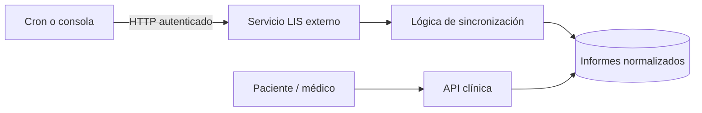

# Laboratorio (resultados externos)

## De qué se trata

Bioenlace **no es un LIS propio**. Se conecta a **laboratorios externos** que publican resultados en estándar clínico (FHIR: informes y analitos). El sistema **trae** esos datos, los **guarda** y el paciente o el equipo los **consultan** en contexto de atención.

## Actores

- **Operaciones / cron:** ejecutan sincronización periódica o por lote.
- **Paciente:** ve listado y detalle en Bioenlace (solo lectura de lo ya importado).
- **Profesional:** ve resultados vinculados al encounter cuando atiende.

## Cómo funciona (ingesta → consulta)

1. **Programación:** un job (cron o comando de consola) recorre pacientes o lotes configurados.
2. **Request externo:** se llama al proveedor (por ejemplo Sianlabs) con credenciales globales por institución.
3. **Normalización:** cada informe y analito se persiste en tablas clínicas unificadas.
4. **Consulta:** el paciente pide “mis resultados” → la API lista lo ya almacenado; el detalle puede incluir enlace a la **atención** donde se pidió el estudio.
5. **PDF:** la descarga se genera en servidor cuando el usuario lo solicita (no es un archivo que “sube” el LIS directo al teléfono).

## Qué no hace hoy

- Alta manual de resultados en pantallas Yii antiguas (módulo retirado).
- Ciclo completo de orden de laboratorio dentro del HIS (pedido → muestra → validación en planta).

## Clasificación y notificación (agente B03)

Tras **ingestar un informe nuevo** con estado `final`, `PostLabClassificationAgent` evalúa analitos (LOINC + umbrales) según `autonomous_agents/post-lab-classification.yaml`:

| Severidad | Efecto |
|-----------|--------|
| **normal** | Push al paciente: resultado dentro de rangos esperados |
| **control** | Push al paciente: conviene seguimiento |
| **critical** | Push urgente al paciente + alerta al profesional del encounter (si hay PES vinculado) |

La decisión queda en `agent_run`. Re-sincronizar el mismo informe **no** re-notifica (idempotencia por `diagnostic_report_id`).

Flag: `autonomous_agent_post_lab_enabled` (default `true`). Detalle: [agentes-autonomos.md](./agentes-autonomos.md).

## Vinculación informe ↔ encounter (agente E01)

Tras ingestar un informe nuevo, `LaboratoryEncounterLinkAgent` puntúa encounters candidatos (mismo día, pedido de lab en `service_request`, proximidad, referencia FHIR).

| Resultado | Comportamiento |
|-----------|----------------|
| **Ganador unívoco** | `encounter_id` persistido automáticamente |
| **Ambigüedad** | Bandeja staff `listar-pendientes-vincular-como-staff`; confirmación con `vincular-informe-a-encounter-como-staff` |
| **Sin match** | Informe huérfano; B03 notifica igual al paciente |

Flag: `autonomous_agent_lab_encounter_link_enabled`.

## Relación con el resto

- Pedidos de estudio en el **encounter** y resumen de **atención paciente** enlazan al informe cuando existe.
- Madurez frente a un LIS hospitalario completo: [his-completo/04-lis.md](../his-completo/04-lis.md).
