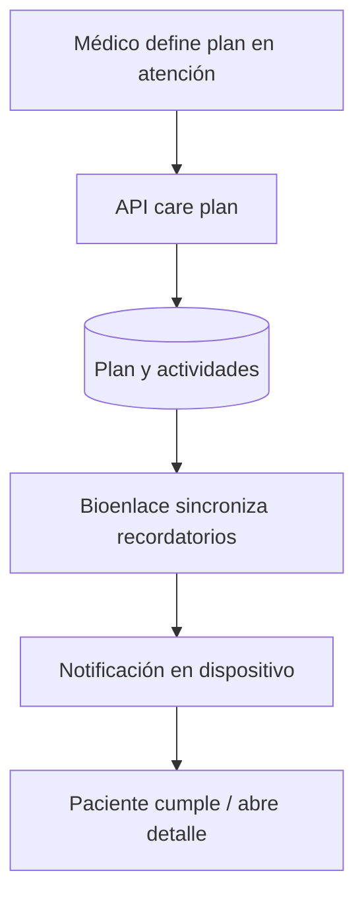

# Planes de tratamiento (care plans)

## De qué se trata

Un plan de tratamiento agrupa **actividades** (medicación, controles, hábitos) para un paciente, a menudo vinculado a un encounter. El paciente ve planes activos y **recordatorios** en su dispositivo cuando el producto lo soporta.

Un **representante** con permiso `clinical.care_plan` puede listar y abrir tratamientos del sujeto pasando `subject_persona_id` (mismo patrón que turnos). Ver [representacion-paciente.md](./representacion-paciente.md).

## Cómo funciona

1. El equipo crea o actualiza el plan desde la atención.
2. El paciente sincroniza desde la API qué recordatorios aplican.
3. El dispositivo dispara avisos según horarios (con preferencias por ítem cuando existen).
4. Al tocar el aviso, abre el detalle del plan en la app.

## Acciones desde el plan (app paciente)

El detalle del plan ofrece acciones directas (renovar medicación, solicitar ajuste, consulta/evolución, pedir turno) que abren **Solicitar Atención** (`atencion.necesito-atencion`) con el CarePlan ya elegido (hub Control/Seguimiento). Renovación y ajuste usan multi-selección de medicamentos del CarePlan; las necesidades async terminan en **consulta clínica por mensaje**.

El mismo hub lista tratamientos activos junto a condiciones y controles recomendados por protocolo. Detalle: [solicitar-atencion.md](./solicitar-atencion.md), [consultas-seguimiento.md](./consultas-seguimiento.md).

## Adherencia para el equipo (staff)

El efector puede ver **qué planes tienen baja cumplimiento** sin revisar paciente por paciente:

- Resumen global: cantidad de planes activos y **porcentaje medio de actividades completadas**.
- Listado de planes con adherencia por plan (útil para priorizar llamados o controles).

API: `GET /api/v1/clinical/care-plans/adherencia-resumen-staff`. Intent: `tratamiento.adherencia-resumen-staff` (pantalla UI JSON en asistente o cliente que la consuma).

Requiere sesión con efector; la autorización sigue el mismo criterio que otros endpoints clínicos del staff.

## Fuera de alcance aquí

Prescripción electrónica emitida (ver [receta-electronica.md](./receta-electronica.md)). Outcomes clínicos automáticos vinculados a la adherencia (pendiente de producto).
