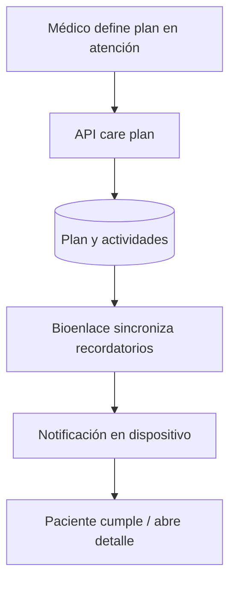

# Planes de tratamiento (care plans)

## De qué se trata

Un plan de tratamiento agrupa **actividades** (medicación, controles, hábitos) para un paciente, a menudo vinculado a un encounter. El paciente ve planes activos y **recordatorios** en su dispositivo cuando el producto lo soporta.

## Cómo funciona

1. El equipo crea o actualiza el plan desde la atención.
2. El paciente sincroniza desde la API qué recordatorios aplican.
3. El dispositivo dispara avisos según horarios (con preferencias por ítem cuando existen).
4. Al tocar el aviso, abre el detalle del plan en Bioenlace.

## Fuera de alcance aquí

Prescripción electrónica emitida (ver [receta-electronica.md](./receta-electronica.md)).
