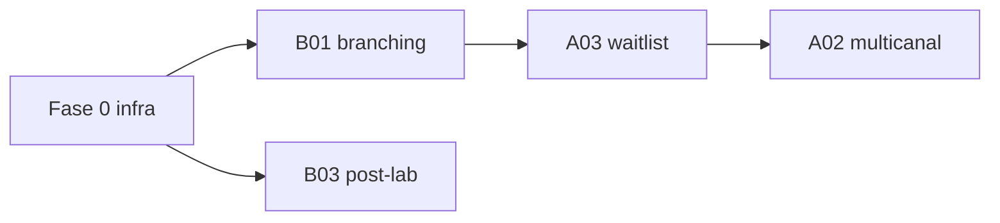

# Plan de implementación — agentes autónomos

Plan operativo derivado de [ideas-a-futuro/agentes-autonomos-backlog.md](../ideas-a-futuro/agentes-autonomos-backlog.md). Cuando un ítem pasa a producción, se documenta en [agentes-autonomos.md](../agentes-autonomos.md) y se tacha o mueve en el backlog de ideas.

---

## Estado por fase

| Fase | Alcance | Estado |
|------|---------|--------|
| **0** | Infra: `agent_run`, metadata `autonomous_agents/`, `AgentRunRecorder`, motor de reglas | **Hecho** |
| **1** | P0 reglas: ~~**B01**~~, **B03** post-lab, **A03** waitlist FIFO, **A02** escalada mínima | En curso (B01 hecho) |
| **2** | P1 agenda: A01 auto-reserva, shortlist, H01, A04/A06 | Pendiente |
| **3** | P1 integración: E01/E02; **C03** / **D02** agente IA | Pendiente |
| **4** | P2: F02, redacción IA en pushes ya decididos por regla | Pendiente |

### Ya en producción (fuera de este plan)

| ID | Qué | Doc |
|----|-----|-----|
| **D03** | Codificación automática CIE-10/SNOMED al guardar encounter | [captura-clinica.md](../captura-clinica.md), [catalogo-usos-ia.md](../catalogo-usos-ia.md) |
| — | Push + grilla reoferta turno | [turnos.md](../turnos.md) |

---

## Fase 0 — Infraestructura transversal

**Objetivo:** un solo patrón evento → política YAML → decisión → acto → auditoría.

| Entregable | Ruta |
|------------|------|
| Tabla auditoría | `agent_run` (migración) |
| Modelo | `common/models/Platform/AgentRun.php` |
| Recorder | `common/components/Platform/Agent/AgentRunRecorder.php` |
| Motor reglas | `common/components/Platform/Agent/AutonomousAgentRuleEngine.php` |
| Metadata | `common/metadata/bioenlace/autonomous_agents/*.yaml` |
| Loader | `AutonomousAgentMetadata` + `ProductMetadataPaths::autonomousAgentsDir()` |

**Criterio de done:** un agente piloto registra `agent_run` con `agent_id`, `rule_id`, `outcome` y `facts_json`.

---

## Fase 1 — Agentes P0 (sin IA en paso decisorio)

### B01 — Touchpoints cohorte (rama D2) — **primer slice**

| Paso | Detalle |
|------|---------|
| Trigger | `CarePackFollowupService::submitResponses` tras persistir respuestas |
| Política | `autonomous_agents/care-followup-branching.yaml` |
| Decisiones | `notify_staff` (empeoramiento / intensidad alta), `educational_push` (adherencia baja) |
| Efecto | Push staff (PES del encounter) + push paciente educativo |
| Auditoría | `agent_run` por regla disparada |

**Dependencias:** cohortes habilitadas (`care_cohort.enabled`), touchpoints ya en cola.

**Complejidad:** S–M (pipeline existente).

### B03 — Post-lab clasificar y notificar

| Paso | Detalle |
|------|---------|
| Trigger | Hook post-`LaboratoryIngestService::upsertReport` (informe `final` nuevo) |
| Política | `autonomous_agents/post-lab-classification.yaml` (LOINC + umbral) |
| Decisiones | normal / control / crítico |
| Efecto v1 | Push paciente + push staff si crítico |
| Auditoría | `agent_run` |

**Gap previo:** persistir `interpretation` / rango en `Observation` si el FHIR lo trae.

**Complejidad:** M.

### A03 — Lista de espera (v1 FIFO)

| Paso | Detalle |
|------|---------|
| Modelo | `turno_waitlist_entry` |
| Trigger | Cancelación de turno con hueco liberado |
| Decisión v1 | Primer inscripto FIFO + push confirmación |
| Sin score** multi-criterio en v1 |

**Complejidad:** L.

### A02 — Multicanal (v1)

| Paso | Detalle |
|------|---------|
| Base | `TurnoNotificacionProgramada` + resolución pendiente |
| v1 | Segundo intento con link firmado (email/SMS stub) tras timeout push |
| v2 | WhatsApp, A06 cierre 72 h |

**Complejidad:** L.

---

## Orden de ejecución recomendado

1. **Fase 0** + **B01** (valida patrón end-to-end con menor riesgo).
2. **B03** (reutiliza infra + push).
3. **A03** (dominio nuevo).
4. **A02** (orquestación temporal).

---

## Documentación por ítem al cerrar

- Ficha en [agentes-autonomos.md](../agentes-autonomos.md) (trigger, política, efecto, auditoría).
- Actualizar doc de dominio ([asistencia-cohortes.md](../asistencia-cohortes.md), [laboratorio.md](../laboratorio.md), [turnos.md](../turnos.md)).
- Marcar ítem en backlog ideas-a-futuro como **implementado** con enlace.
- Costos: solo si hay agente IA o redacción IA facturable aparte ([catalogo-usos-ia.md](../catalogo-usos-ia.md)).

---

## Relación con arquitectura

- Sin `if (intent_id)` en orquestadores; política en YAML / params.
- Servicios de dominio ejecutan el acto (push, persistencia, turno).
- Jobs/colas existentes (`CareFollowupTouchpointProcessor`, `LaboratorySyncController`, `TurnoNotificacionController`).
