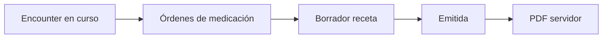

# Receta electrónica

## De qué se trata

Bioenlace separa la **orden de medicación** en la consulta del **documento legal emitido** (receta): numeración propia, vigencia, hash de verificación y PDF para el paciente. La orden clínica (`MedicationRequest`) y la receta emitida son conceptos distintos; una receta puede agrupar líneas derivadas de esas órdenes.

Normativa de referencia en Argentina: Ley 27.553 y perfil nacional de Receta Digital (FHIR RDI). Hoy el circuito **interno** (borrador → emitida → anulada → PDF) está operativo; la **integración con repositorio oficial** es evolución cuando haya contrato y credenciales.

## Actores

| Actor | Rol |
|-------|-----|
| **Profesional** (con PES en el encounter) | Crea borrador desde la atención, emite, anula |
| **Paciente** | Lista recetas emitidas, ve detalle, descarga PDF |
| **Verificador externo** | Consulta pública por código de verificación (sin login) |
| **Operaciones** (futuro) | Conciliación con repositorio nacional |

## Cómo funciona (staff)

1. Durante la atención se documentan medicamentos como órdenes clínicas.
2. El profesional crea un **borrador** de receta electrónica ligado al encounter (líneas asociadas a órdenes o texto libre según producto).
3. Al **emitir**, el sistema asigna número, vigencia, token de verificación y hash; el estado pasa a emitida.
4. El paciente puede descargar **PDF** generado en servidor; el staff puede **anular** con motivo mientras aplique la regla de negocio.

## Cómo funciona (paciente)

1. Desde Bioenlace accede a **mis recetas** (listado propio).
2. Abre detalle de una receta emitida.
3. Descarga PDF o comparte código de verificación según pantalla.

El resumen de atención publicado al paciente puede enlazar a la receta cuando corresponde.

## API principal

| Acción | Método / ruta |
|--------|----------------|
| Crear borrador en encounter | `POST …/clinical/encounter/{id}/electronic-prescription/crear-borrador` |
| Listar por encounter (staff) | `GET …/clinical/encounter/{id}/electronic-prescriptions` |
| Ver receta (staff) | `GET …/clinical/electronic-prescription/{id}` |
| Emitir | `POST …/clinical/electronic-prescription/{id}/emitir` |
| Anular | `POST …/clinical/electronic-prescription/{id}/anular` |
| Mis recetas (paciente) | `GET` o `POST …/clinical/electronic-prescription/mis-recetas-como-paciente` |
| Ver receta (paciente) | `GET` o `POST …/clinical/electronic-prescription/ver-receta-como-paciente` |
| Descargar PDF (paciente) | `GET …/clinical/electronic-prescription/descargar-pdf-como-paciente` |
| Verificación pública | `GET …/clinical/electronic-prescription/verificar-receta` |

## Modos de producto

| Modo | Descripción |
|------|-------------|
| **MVP interno** | Emisión y PDF en Bioenlace; sin farmacia ni repositorio nacional |
| **Circuito oficial** (futuro) | Registro en operador Receta Digital / provincial |
| **Híbrido** | MVP hoy; conmutación al circuito oficial cuando exista homologación |

## Qué no hace hoy

- Firma digital homologada plena (PKI nacional).
- Registro automático en repositorio Receta Digital MSAL.
- Dispensación en farmacia enlazada al estado de la receta.
- Emisión conversacional desde el asistente como flujo principal.
- Receta de lentes (subtipo aparte: prescripción de visión).

## Relación con el resto

| Tema | Documento |
|------|-----------|
| Captura y cierre de atención | [captura-clinica.md](./captura-clinica.md) |
| Export FHIR de la atención (incluye receta emitida) | [interoperabilidad-historia-clinica.md](./interoperabilidad-historia-clinica.md) |
| Madurez HIS | [his-completo/06-receta-electronica.md](../his-completo/06-receta-electronica.md) |
| Modelo clínico FHIR | [decisions/fhir-clinical.md](../decisions/fhir-clinical.md) |
