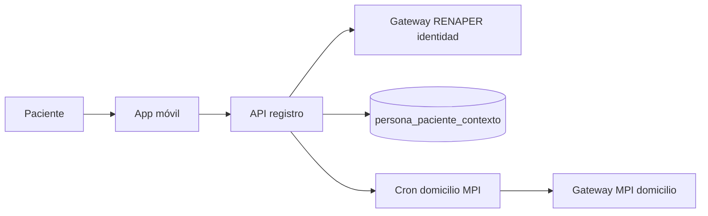
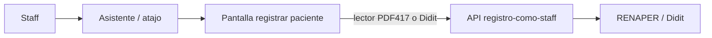

# Registro e identidad de paciente

## De qué se trata

Bioenlace da de alta **personas paciente** con identidad validada (RENAPER / Didit), persiste el registro en la base local y encadena verificación de domicilio y **contexto operativo** (sector de salud, provincia) sin depender del flujo MPI histórico de candidatos y empadronamiento.

Hay **dos circuitos** con el mismo núcleo de dominio (`RegistroService`, gateway MPI):

| Circuito | Quién | Superficie |
|----------|-------|------------|
| **Autoregistro** | Paciente | App móvil |
| **Alta por personal** | Staff (enfermería, admisión, etc.) | Pantalla embebible vía **asistente** (`/personas/registrar-paciente`) |

La navegación operativa del staff **no usa breadcrumbs ni menús MVC legacy**: el punto de entrada es el **asistente** (intents, atajos, pantallas JSON). Las rutas web clásicas de «buscar persona» / candidatos MPI están **retiradas**.

## MPI: qué queda y qué no

El gateway MPI/SEIPA quedó **reducido** a capacidades declarativas (`mpiCapabilities` en params; por defecto `renaper`, `coberturas` y `domicilio`):

| Capacidad | Uso actual |
|-----------|------------|
| **RENAPER** (`renaper?`) | Validar identidad (nombre, documento, fecha nacimiento) |
| **Domicilio** (`domicilio?`) | Obtener domicilio declarado para persistencia post-alta |
| **Coberturas** (`coberturas?`) | Consulta de cobertura cuando el producto la pide |
| ~~Candidatos~~ | **Retirado** — no hay búsqueda federada ni lista de matches |
| ~~Empadronar / asociar / traer paciente~~ | **Retirado** del flujo de alta |

Intentos de usar las pantallas legacy (`buscar-persona` con formulario MPI, `lista-candidatos`, `seleccionar-persona`) responden **410 Gone** con mensaje que deriva al flujo nuevo.

## Actores

| Actor | Rol |
|-------|-----|
| **Paciente** | Se registra en la app; completa contexto (sector, provincia); no edita domicilio MPI desde la app |
| **Staff no médico** | Alta con lector PDF417 del DNI o foto Didit; confirma éxito en pantalla |
| **Personal médico** | No es el destinatario del alta **paciente** por asistente; la **ficha clínica** (`personas/view`) es exclusiva de rol médico |

## Usuarios del personal de salud (distinto del alta paciente)

El **login del personal** (web y app Personal de Salud) usa un **usuario Yii** que gestiona el **AdminEfector**:

- **Primera vez** en cualquier efector: AdminEfector **crea** el usuario y lo asigna al efector con rol RBAC.
- **Cambio de efector**: AdminEfector del nuevo centro **vincula** la misma persona/usuario; no se crea otro login.
- La **app móvil Personal de Salud no registra** personal; solo login + sesión operativa.

El endpoint `registrar-como-staff` y flujos Didit/RENAPER del asistente sirven para **dar de alta personas paciente** desde el staff, no para autoregistro del personal. Detalle operativo: [admin_efector/gestion-efector.md](../qa/admin_efector/gestion-efector.md) § Usuarios del efector.
| **Sistema** | Cron de verificación domicilio MPI; encauzamiento por contexto paciente |

## Autoregistro (app paciente)

1. El paciente valida identidad (Didit u otro modo configurado en app).
2. Se crea `Persona`, usuario y rol paciente (`RegistroService`).
3. Se inicializa **contexto paciente** (`sector_salud`, `id_provincia_contexto`, estado de verificación de domicilio).
4. El domicilio MPI se persiste en **segundo plano** (reintentos ~30 min, ventana 24 h).
5. La app muestra banner/scope de contexto y ofrece recursos provinciales según metadata (`paciente-contexto-offering.yaml`).

## Alta por personal (staff)

**Modos de identidad:**

- **Lector DNI:** escaneo PDF417 → preview RENAPER → confirmar alta.
- **Didit:** sesión hosted de verificación → callback → confirmar alta con `verification_id`.

**Post-alta (producto):**

- Mensaje de éxito **en la misma pantalla** (nombre, DNI, `id_persona`).
- Opción «Registrar otro paciente».
- En admin, enlace opcional a **datos personales** (`admin-view`), no a historia clínica.
- **No** se redirige a `personas/view` (ficha clínica).
- **No** se modifica la **sesión operativa del staff** con el paciente recién dado de alta: la sesión del profesional sigue siendo su contexto (efector, servicio, rol). Cuando un flujo posterior necesita un paciente concreto, el asistente o la API reciben **`id_persona` explícito** en el request o en el borrador del flow — no se «contamina» la sesión staff con el último alta.

## Contexto paciente (`persona_paciente_contexto`)

Persistente por persona; guía encauzamiento de producto:

| Campo / idea | Comportamiento |
|--------------|----------------|
| `sector_salud` | Default `PUBLICO`; afecta oferta de turnos, efectores, home e intents |
| `id_provincia_contexto` | Provincia de referencia del paciente (y del representante al actuar por otro) |
| Verificación domicilio | Estados y reintentos; domicilio MPI inmutable desde apps |

Servicios de offering leen metadata YAML (`paciente-contexto-offering.yaml`, `recursos-provinciales.yaml`) — sin reglas hardcodeadas en orquestadores.

## API principal

| Acción | Ruta |
|--------|------|
| Registro paciente (app) | `POST /api/v1/registro/...` (flujo móvil existente) |
| Registro como staff | `POST /api/v1/registro/registrar-como-staff` |
| Preview RENAPER staff | `POST /api/v1/registro/preview-renaper-como-staff` |
| Sesión Didit staff | `POST /api/v1/registro/crear-sesion-didit-como-staff` |
| Contexto paciente | `GET/POST /api/v1/paciente-contexto/...` |
| Recurso provincial (staff/paciente) | según intent y `PacienteContextoOfferingService` |

Permisos API staff heredan del mismo perfil que operaba búsqueda/alta de personas (`buscar-persona` en RBAC histórico).

## Configuración y operación

- `didit_paciente_kyc_workflow_id` en params locales (Didit staff y app).
- `mpiCapabilities`: mantener lo necesario (`renaper`, `domicilio`, `coberturas`).
- Cron `paciente-domicilio/run` para verificación/persistencia de domicilio post-alta vía MPI.
- Migraciones de contexto paciente y RBAC registro staff en despliegue.

## Relación con otros documentos

- [apps-paciente-personalsalud.md](./apps-paciente-personalsalud.md) — visión general paciente y personal de salud
- [asistente-y-chat.md](./asistente-y-chat.md) — entrada staff a pantallas embebidas
- [representacion-paciente.md](./representacion-paciente.md) — operar por otro paciente (sujeto explícito, no sesión staff)
- [turnos.md](./turnos.md) — reserva con `id_persona` o `subject_persona_id` según actor
