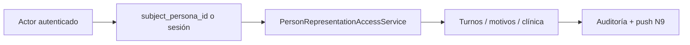
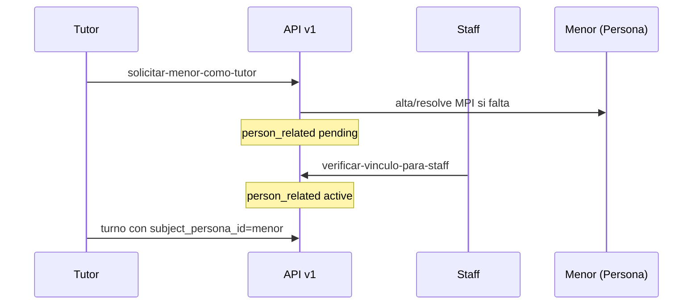
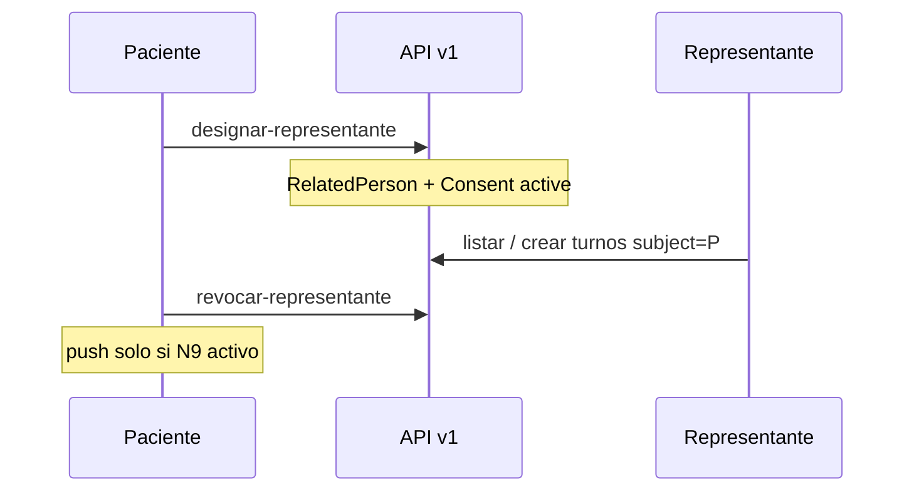

# Representación de paciente (tutela y delegación)

## De qué se trata

Bioenlace asume por defecto **una cuenta = una persona** (`getIdPersona()` es el sujeto del turno, motivos, pre-consulta y tratamientos). Este módulo permite que un adulto con cuenta **opere en nombre de otro paciente** en dos regímenes:

| Régimen | Quién inicia | Sujeto típico | Activación |
|---------|--------------|---------------|------------|
| **A — Tutela verificada** | Padre, madre o tutor legal | Menor **sin cuenta** | Staff verifica el vínculo |
| **B — Delegación** | Paciente con cuenta | Otro adulto con cuenta | Designación del paciente (sin aceptación del representante) |

**Antecedente clínico familiar** (historia, programas) ≠ **representación operativa**. Solo lo segundo autoriza turnos, motivos, cohortes y acceso paciente a HC/tratamientos.

Alineación conceptual FHIR: `Patient` → `personas`; vínculo → `RelatedPerson` (`person_related`); delegación activa → `Consent` (`person_delegation_consent`).

## Actores

| Actor | Rol |
|-------|-----|
| **Titular de cuenta** | Puede ser tutor (A) o representante (B) |
| **Sujeto** | `Persona` sobre la que se actúa (menor sin login o paciente delegante) |
| **Staff** | Verifica tutela (A), bloquea por orden legal, revoca vínculos |
| **Sistema** | Valida identidad (RENAPER/MPI), audita actos delegados, push opcional (N9) |

## Decisiones de producto (cerradas)

- **A:** padre, madre y tutor legal; ambos padres pueden operar si están verificados; el vínculo **no** corta solo a los 18 años.
- **B:** sin aceptación del representante; varios representantes simultáneos; cualquier persona con cuenta.
- **Permisos v1:** turnos, motivos, pre-consulta, care plan/recetas, resumen de HC (alcance paciente).
- **Staff** puede bloquear; notificación al paciente solo si activa la preferencia **N9**.

## Cómo opera el representante (API)

El JWT sigue siendo del **actor**. El sujeto de atención va en `subject_persona_id` (body/query) o en sesión web (`establecer-sujeto-paciente`).

1. El sistema resuelve el sujeto (`PersonRepresentationSubjectService`).
2. Comprueba permiso v1 (`canAct`) y régimen activo (B exige consentimiento activo).
3. Ejecuta la acción de dominio como si fuera el paciente sujeto.
4. Si actor ≠ sujeto: registra auditoría y, si N9 está activo, notifica al paciente (`REPRESENTATIVE_ACTION`).

## Régimen A — tutela verificada

- Solicitud: parentesco (`padre`, `madre`, `tutor_legal`), documento del menor, evidencia si aplica.
- Hasta verificación staff el vínculo queda `pending`.
- Dos padres verificados = dos filas activas independientes.

## Régimen B — delegación

- Designación por documento o `id_persona` del representante.
- Varios representantes activos con la misma plantilla de permisos v1.
- Revocación por el paciente o por staff.

## Experiencia paciente (móvil)

| Superficie | Función |
|------------|---------|
| Chip **«A cargo de»** (inicio) | Elegir «Yo» u otro paciente con representación activa |
| **Configuración → Representación** | Hub: tutela, representantes, pacientes a cargo, preferencia N9 |
| Asistente | Intents `personas.vincular-menor-flow`, `personas.designar-representante-flow` → pantalla nativa `person_representation_hub` |

Al cambiar sujeto, la app propaga `subject_persona_id` en turnos, tratamientos activos, pre-consulta y sesión API.

Código compartido: `mobile/packages/shared/lib/person/person_representation_*.dart`.

## Asistente web / SPA

- Catálogo: `PersonRepresentationUiActionCatalog` (registrado en `UiActionCatalog`).
- Flows YAML en `SubIntentEngine/schemas/intents/personas.*.yaml`.
- Acción hub con `client_open.kind: native` → móvil; web → configuración.

## Staff

Endpoints bajo `/api/v1/person-representation/` (RBAC ApiGhost):

- Verificar, bloquear o revocar vínculos de un paciente.
- Listar vínculos de un sujeto (`vinculos-paciente-para-staff`).

## Permisos v1

| Código | Producto |
|--------|----------|
| `scheduling.turno` | Reservar y gestionar turnos |
| `clinical.motivos` | Motivos de consulta |
| `clinical.care_pack_assistance` | Pre y post consulta por cohorte (asistencia + seguimiento) |
| `clinical.care_plan` | Tratamientos y recetas (vista paciente) |
| `clinical.historia_resumen` | Resúmenes de atención / HC resumida |

Plantilla: `representation_permissions_v1.yaml` (metadata, no hardcode en orquestadores).

## Notificaciones (N9)

Preferencia `notify_on_representative_action` (default **false**) en `person_representation_pref`.

Si está activa, cada acción delegada auditada puede disparar push + bandeja in-app con tipo `REPRESENTATIVE_ACTION` (turno creado/cancelado, motivos, pre-consulta, seguimiento cohorte, HC, tratamiento).

## Notificaciones proactivas al sujeto

Resumen de atención y touchpoints de seguimiento cohorte **no** se envían solo al `subject_persona_id` del encounter: el menor sin cuenta no recibe push. Destinatarios:

- el paciente sujeto, si tiene cuenta;
- **todos** los tutores verificados (régimen A) o representantes activos (régimen B) con el permiso v1 correspondiente (`clinical.historia_resumen` o `clinical.care_pack_assistance`).

Implementación: `PersonRepresentationNotifyRecipientService`.

## Relación con otros documentos

- [apps-paciente-medico.md](./apps-paciente-medico.md) — chip y hub en la app paciente
- [turnos.md](./turnos.md) — reserva con sujeto delegado
- [asistente-y-chat.md](./asistente-y-chat.md) — intents `personas.*`
- [planes-de-tratamiento.md](./planes-de-tratamiento.md), [resumen-atencion-paciente.md](./resumen-atencion-paciente.md) — mismos permisos v1 con `subject_persona_id`

## Fuera de alcance

- API FHIR REST pública RelatedPerson/Consent
- Menor con cuenta propia como flujo principal
- Árbol genealógico / validación gubernamental de parentesco
- Unificar `PersonaProgramaDiabetes::PARENTESCO` con el catálogo global (posible trabajo futuro)

## Referencia técnica

- Dominio: `common/components/Domain/Person/Representation/`
- API: `PersonRepresentationController`
- Autorización transversal: `PersonRepresentationSubjectService`
