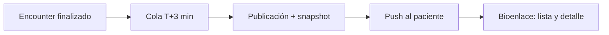
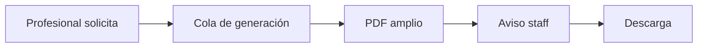

# Resumen de atención (paciente) y expediente (staff)

## De qué se trata

Tras una consulta **ambulatoria finalizada**, el paciente recibe un **resumen legible** (texto trabajado con IA al guardar) y enlaces a recetas, pedidos y laboratorio. El **expediente legal amplio** es solo para staff autorizado, en PDF generado en cola.

## Resumen para el paciente

1. Al cerrar la atención ambulatoria, el sistema **encola** la publicación unos minutos después.
2. Un proceso en segundo plano arma el resumen y **notifica** (“tu resumen está listo”).
3. El paciente abre desde push o “Mis atenciones” y ve narrativa + vínculos.

## Expediente legal (staff)

- Solo roles con permiso dedicado; no está disponible para el paciente.
- Auditoría de quién solicitó y quién descargó.

## Qué ve el paciente en el detalle

Además del texto narrativo: enlaces a receta electrónica, informes de laboratorio vinculados y pedidos (con estado pendiente o con resultado cuando ya existe).
