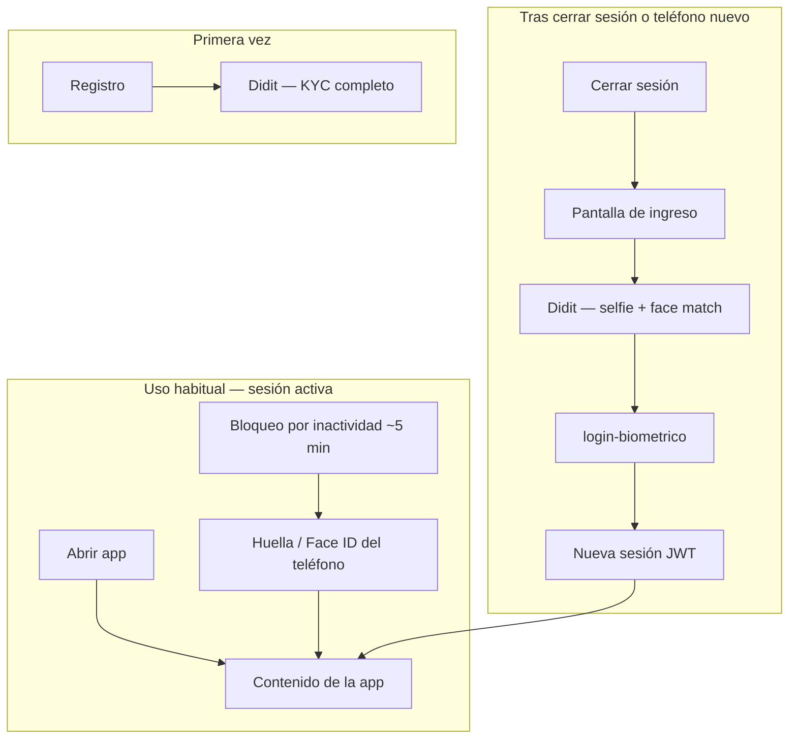

# Sesión e ingreso — app paciente

## De qué se trata

La app del paciente combina **tres momentos de autenticación** distintos. Didit interviene solo donde hace falta identidad remota; el día a día usa la biometría del teléfono sin costo de verificación externa.

## Actores

| Actor | Rol |
|-------|-----|
| **Paciente** | Usa la app, puede cerrar sesión o cambiar de dispositivo |
| **Didit** | KYC en el registro; biometría remota al reingresar tras logout |
| **Bioenlace API** | Emite JWT tras validar la sesión Didit (`POST /api/v1/auth/login-biometrico`) |

## Cómo funciona

### 1. Registro (una vez)

- El paciente completa **KYC Didit** (documento + selfie + liveness).
- Bioenlace crea persona, usuario y guarda `didit_reference_id` para vincular reingresos.
- Detalle: [registro-paciente.md](./registro-paciente.md).

### 2. Día a día (sesión activa)

- El JWT y el contexto viven en el dispositivo.
- Si la app se bloquea por inactividad, **solo** pide huella o Face ID **local** — sin llamada a Didit.
- Componente: `BiometricSessionLockScope` en la app paciente.

### 3. Reingreso tras cerrar sesión

- **Cerrar sesión** borra JWT, usuario y token local; la pantalla de ingreso ofrece **verificación Didit remota**.
- Flujo: SDK Didit (workflow biométrico) → `POST /api/v1/auth/login-biometrico` con `biometric_verification_id` → JWT nuevo.
- Si el teléfono tiene huella o Face ID, puede pedirse **después** de Didit como segundo factor opcional en el mismo dispositivo.
- Si el dispositivo no tiene biometría local, el ingreso igual puede completarse solo con Didit (selfie).

### Workflows Didit en servidor

| Parámetro | Uso |
|-----------|-----|
| `didit_paciente_kyc_workflow_id` | Registro y alta staff con foto |
| `didit_paciente_biometric_workflow_id` | Reingreso tras logout (recomendado) |

La app obtiene los UUID vía `GET /api/v1/registro/config-movil` (sin auth). Si no hay workflow biométrico dedicado, el servidor puede devolver el de KYC como respaldo — ver sección siguiente.

### ¿Alcanza con un solo workflow?

| Situación | ¿Funciona? | Recomendación |
|-----------|------------|---------------|
| Solo `didit_paciente_kyc_workflow_id` (KYC completo) | El servidor lo reutiliza como fallback; el paciente **podría** tener que repetir escaneo de DNI además de la selfie | **Aceptable para piloto**, no ideal en producción |
| `didit_paciente_biometric_workflow_id` con módulo **Biometric Authentication** en Didit Console | Selfie + liveness + face match 1:1 contra el rostro enrolado en el KYC inicial | **Recomendado** — mejor UX y tarifa menor (~USD 0,10 vs ~0,33 por sesión) |

En Didit Console conviene un workflow de reingreso que incluya **solo** Biometric Authentication (sin ID Verification de documento). El KYC inicial ya enroló el rostro del paciente.

### Costos

Proyección por altas y reingresos: [costos-didit.md](../costos/costos-didit.md).

### Acceso revisores Google Play

No usa Didit: flujo oculto documentado en `mobile/PLAY_APP_ACCESS.md`.

## Relación con otros documentos

- [registro-paciente.md](./registro-paciente.md) — alta e identidad inicial
- [apps-paciente-personalsalud.md](./apps-paciente-personalsalud.md) — visión general paciente vs personal de salud
- [costos-didit.md](../costos/costos-didit.md) — presupuesto KYC y reingreso
