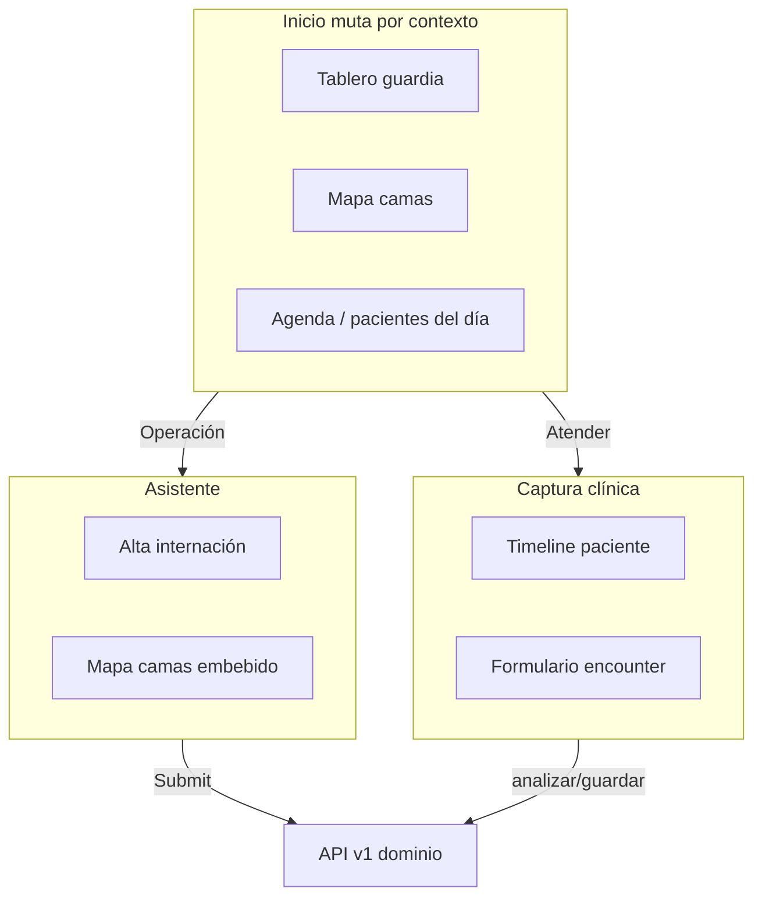

# Superficies de UI — web y móvil

## Principio

**Web staff y app médico comparten la misma API y la misma sesión operativa** (efector, servicio, `encounter_class`, rol). La diferencia es solo el renderer (Yii, Flutter, asistente). No hay una tercera UI clínica por módulo (p. ej. pestañas MVC de internación).

## Tres tipos de superficie

| Tipo | Qué muestra | Qué muta la UI |
|------|-------------|----------------|
| **Inicio / paneles** | Tableros, mapas, colas, KPIs, accesos rápidos | `encounter_class` + rol + efector/servicio en sesión |
| **Captura clínica (encounter)** | Estado del paciente + registro del encuentro | Encounter + rol + **especialidad** (`EncounterDefinition` / `workflow_json`) |
| **Flows del asistente** | Acciones puntuales con pasos | Intent YAML + UI JSON descubierta |

## Inicio (página de inicio del médico)

- Equivalente al **home de la app médico**: muta según rol y `encounter_class` en sesión. Datos: **`GET /api/v1/home/panel`** (web `site/index`, móvil staff).
- Ejemplos: tablero EMER, mapa de camas IMP, listado ambulatorio AMB.
- **Paciente web/móvil** (sin sesión operativa): mismo endpoint con audiencia `patient` y layout `patient_home` (próximos turnos + planes activos).
- **Sin sesión operativa (staff)**: layout `cards` con atajos del asistente.
- **No** es lugar de captura clínica ni de formularios largos por pestaña.

Referencias: [apps-paciente-medico.md](./apps-paciente-medico.md), [urgencias-guardia.md](./urgencias-guardia.md), [internacion.md](./internacion.md).

## Captura clínica (timeline + formulario)

- Shell web: `PacienteController::actionHistoria` + partial `_formulario_consulta.php`.
- Contexto vía query/hidden: `id_persona`, `parent` (`Encounter::PARENT_*`), `parent_id`, `id_consulta` (= encounter id), `id_configuracion`.
- La **mutación por especialidad** no va hardcodeada en la vista: la resuelve `EncounterDefinition` (`service_id` + `encounter_class` → `workflow_json`).
- Persistencia: `POST /api/v1/clinical/encounter/guardar` (FHIR).
- Enlaces de entrada: `PatientHistoriaUrl::captura()` desde turnos, guardia, internación, etc.

Referencias: [captura-clinica.md](./captura-clinica.md).

## Flows (asistente)

- Todo lo que encaje como **wizard conversacional** → intent + UI JSON, no vista MVC tradicional.
- Ejemplos: alta estructurada, mapa de camas embebible, triage guardia.

Referencias: [asistente-y-chat.md](./asistente-y-chat.md).

## Regla de decisión

| Pregunta | Destino |
|----------|---------|
| ¿Tablero operativo del efector/rol? | Inicio |
| ¿Documentar o completar un encuentro con un paciente? | Timeline + formulario encounter |
| ¿Acción acotada con pasos? | Flow del asistente |
| ¿Configuración institucional (ABM)? | Web admin delgada o flow admin (menor prioridad) |

## Internación (IMP) en este modelo

- **Mapa / ronda / indicadores** → inicio (panel IMP), no formulario clínico.
- **Evolución, dx, meds, prácticas en piso** → timeline con `parent=INTERNACION`, `parent_id=<id_internacion>`.
- **Alta, cambio de cama, ingreso desde guardia** → flows (`internacion.*-flow`) o shell operativo mínimo hasta migrar.
- **`/internacion/view`** → ficha **administrativa** del episodio (cama, ingreso, alta), no pestañas clínicas MVC.
