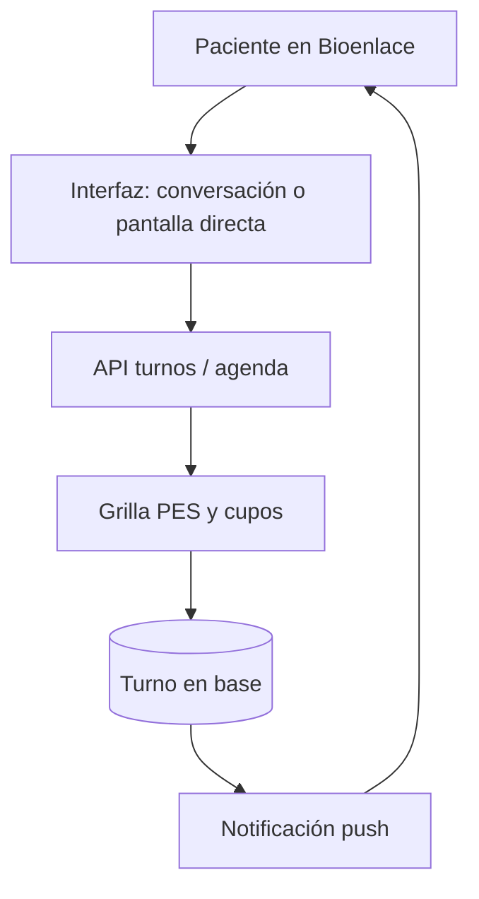

# Turnos

## De qué se trata

Un **turno** es la cita entre una persona y un profesional en un efector y servicio: fecha, hora, estado (pendiente, cancelado, atendido, en resolución…) y reglas de **autogestión** para el paciente (reservar, cancelar, reprogramar con anticipación mínima).

## Actores

- **Paciente:** reserva y gestiona citas desde Bioenlace.
- **Profesional y administración del efector:** calendario, alta para terceros, sobreturnos, cancelación masiva de un día.
- **Sistema:** recordatorios y avisos cuando cambia la agenda o el turno entra en conflicto.

## Cómo funciona (reserva paciente)

1. El paciente elige **efector y servicio** (sesión operativa o flujo guiado).
2. La API consulta **disponibilidad** alineada a la agenda del profesional (PES: profesional–efector–servicio).
3. Al confirmar, se **persiste** el turno y puede dispararse confirmación o recordatorio según política del efector.
4. Si el efector **cambia la agenda** (cancelación masiva, bloqueo), los turnos afectados pueden pasar a **en resolución** y el paciente recibe **push** para reubicar o cancelar.

## Cancelación y reprogramación

- El paciente solo puede actuar dentro de ventanas configuradas (horas de anticipación).
- El médico o staff puede cancelar con otro alcance de permisos.
- La política evita huecos imposibles y mantiene trazabilidad del cambio.

## Relación con el resto del producto

- Un turno puede originar un **encounter** ambulatorio al atenderse (captura clínica).
- Los turnos también se pueden iniciar por conversación; el detalle técnico del motor está en [arquitectura/asistente-motores.md](../arquitectura/asistente-motores.md).

## Fuera de este documento

Facturación del acto, contenido clínico del encuentro y RRHH puro sin cita agendada.
