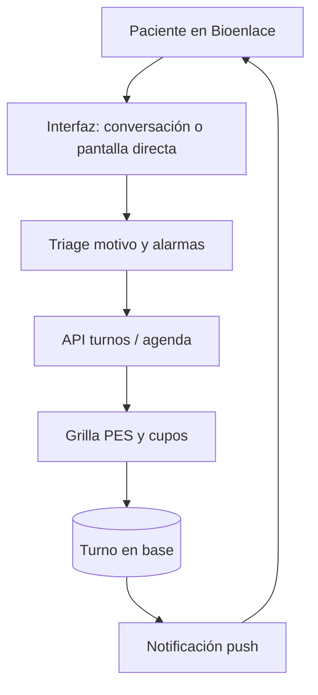

# Turnos

## De qué se trata

Un **turno** es la cita entre una persona y un profesional en un efector y servicio: fecha, hora, estado (pendiente, cancelado, atendido, en resolución…) y reglas de **autogestión** para el paciente (reservar, cancelar, reprogramar con anticipación mínima).

## Actores

- **Paciente:** reserva y gestiona citas desde Bioenlace.
- **Tutor o representante:** puede reservar y gestionar turnos **de otro paciente** (menor sin cuenta o adulto que delegó), fijando `subject_persona_id` o el contexto «A cargo de» en móvil. Ver [representacion-paciente.md](./representacion-paciente.md).
- **Profesional y administración del efector:** calendario, alta para terceros, sobreturnos, cancelación masiva de un día.
- **Staff (admisión / enfermería):** alta de persona vía asistente (lector DNI / Didit); no implica fijar paciente en la sesión operativa del staff — ver [registro-paciente.md](./registro-paciente.md).
- **Sistema:** recordatorios y avisos cuando cambia la agenda o el turno entra en conflicto.

## Cómo funciona (reserva paciente)

1. **Triage breve** (motivo, alarmas, zona/evolución según el caso): catálogo fijo + UI JSON; si hay **banda A** no se sigue con la reserva en la app. Detalle: [triage-reserva-turno.md](./triage-reserva-turno.md).
2. El paciente elige **servicio**; si el caso y el servicio lo permiten, **modalidad** (presencial o teleconsulta); luego **centro, profesional y horario** (flujo asistente `atencion.necesito-atencion`; `turnos.crear-como-paciente` solo agenda si ya sabe que quiere turno). Elegibilidad remota: [teleconsulta-elegibilidad.md](./teleconsulta-elegibilidad.md).
3. La API consulta **disponibilidad** alineada a la agenda del profesional (PES).
4. Al confirmar, se **persiste** el turno (incluye `reserva_triage_*` y `urgency_band`) y puede dispararse confirmación o recordatorio.
5. Tras la reserva, los **motivos pre-consulta** (chat/IA) enriquecen el encuentro hasta el turno — no sustituyen el triage de reserva.
6. Si el efector **cambia la agenda**, los turnos afectados pueden pasar a **en resolución** y el paciente recibe **push** para reubicar o cancelar.

## Cancelación y reprogramación

- El paciente solo puede actuar dentro de ventanas configuradas (horas de anticipación).
- El médico o staff puede cancelar con otro alcance de permisos.
- La política evita huecos imposibles y mantiene trazabilidad del cambio.

## Indicadores de agenda (staff)

Para **dirección y coordinación** del efector, el equipo puede consultar métricas de acceso sin exportar planillas:

- **No-show:** turnos `SIN_ATENDER` atribuibles al paciente en el período.
- **Tasa de no-show** sobre turnos cerrados (atendidos + ausentes).
- **Lead time:** mediana y promedio de días entre la **fecha de reserva** y la **fecha de la cita**.

Superficies: API `GET /api/v1/turnos/indicadores-agenda` (filtros por período y PES); intent de asistente `turnos.indicadores-agenda-flow` (UI JSON embebida).

## Lista de espera (agente A03, v1 FIFO)

Cuando un turno se **cancela** y queda un hueco en agenda, el sistema puede ofrecerlo al primer paciente inscripto en lista de espera para ese efector y servicio.

1. El paciente se **inscribe** vía API (`POST …/lista-espera-inscribir-como-paciente`) indicando efector, servicio y opcionalmente PES o banda de urgencia.
2. Tras una cancelación, el agente `turno-waitlist-fill` elige el candidato FIFO (excluye banda A de ofertas), envía push `TURNO_WAITLIST_OFFER` con token de oferta y TTL configurable (15 min por defecto).
3. El paciente **acepta** con `POST …/lista-espera-aceptar-oferta-como-paciente` (`offer_token`); se crea el turno en el slot si sigue libre.
4. Si expira el TTL, el cron `yii turno-waitlist/expire-offers` marca la oferta vencida y ofrece al siguiente en cola.

Parámetros: `turnosWaitlist` en `params.php`. Flag: `autonomous_agent_waitlist_enabled`. Detalle técnico: [agentes-autonomos.md](./agentes-autonomos.md).

## Escalada multicanal (agente A02, v1)

Si el paciente no responde al push de reubicación dentro del plazo configurado (24 h por defecto), el agente `turno-resolucion-multicanal` escala a **email** y luego **SMS** (stub en v1: log + mailer si está disponible).

1. Al marcar un turno `EN_RESOLUCION` y enviar push, se programa `RESOLUCION_MULTICANAL` en `turno_notificacion_programada`.
2. El cron `yii turno-notificacion/run` ejecuta el agente: genera **link firmado** y lo incluye en el mensaje.
3. La página pública `/turno/resolucion/{token}` muestra el turno y un botón hacia la app para reubicar.

Parámetros: `turnoResolucionMulticanal` (`public_base_url`, `app_deep_link`, `signing_key`). Flag: `autonomous_agent_resolucion_multicanal_enabled`.

## Relación con el resto del producto

- Representación operativa (tutela/delegación): [representacion-paciente.md](./representacion-paciente.md).
- Un turno puede originar un **encounter** ambulatorio al atenderse (captura clínica).
- Los turnos también se pueden iniciar por conversación; el detalle técnico del motor está en [arquitectura/asistente-motores.md](../arquitectura/asistente-motores.md).
- Madurez HIS del módulo: [his-completo/11-agenda-turnos.md](../his-completo/11-agenda-turnos.md).

## Fuera de este documento

Facturación del acto, contenido clínico del encuentro y RRHH puro sin cita agendada.
