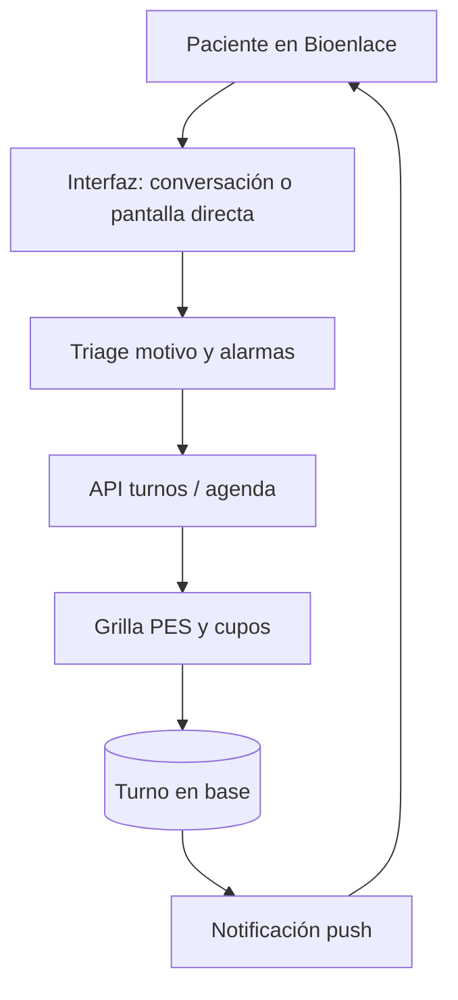

# Turnos

## De qué se trata

Un **turno** es la cita **ambulatoria (AMB)** entre una persona y un profesional en un efector y servicio: fecha, hora, estado (pendiente, cancelado, atendido, en resolución…) y reglas de **autogestión** para el paciente (reservar, cancelar, reprogramar con anticipación mínima).

La grilla de cupos es solo `encounter_class = AMB`. Guardia e internación usan **cobertura** (roster), no turnos de paciente — ver [agenda-por-encounter-class.md](./agenda-por-encounter-class.md).

## Actores

- **Paciente:** reserva y gestiona citas desde Bioenlace.
- **Tutor o representante:** puede reservar y gestionar turnos **de otro paciente** (menor sin cuenta o adulto que delegó), fijando `subject_persona_id` o el contexto «A cargo de» en móvil. Ver [representacion-paciente.md](./representacion-paciente.md).
- **Profesional y administración del efector:** calendario, alta para terceros, sobreturnos, cancelación masiva de un día.
- **Staff (admisión / enfermería):** alta de persona vía asistente (lector DNI / Didit); no implica fijar paciente en la sesión operativa del staff — ver [registro-paciente.md](./registro-paciente.md).
- **Sistema:** recordatorios y avisos cuando cambia la agenda o el turno entra en conflicto (**push**; WhatsApp utility **no** habilitado — ver [notificaciones](#notificaciones-push-y-whatsapp)).

## Cómo funciona (reserva paciente)

1. **Triage breve** (motivo, alarmas, zona/evolución según el caso): catálogo fijo + UI JSON; si hay **banda A** no se sigue con la reserva en la app. Detalle: [triage-reserva-turno.md](./triage-reserva-turno.md).
2. El paciente elige **servicio**; si el caso y el servicio lo permiten, **modalidad** (presencial o teleconsulta); luego **centro, profesional y horario** (flujo asistente `atencion.necesito-atencion`; `turnos.crear-como-paciente` solo agenda si ya sabe que quiere turno). Elegibilidad remota: [teleconsulta-elegibilidad.md](./teleconsulta-elegibilidad.md).
3. La API consulta **disponibilidad** alineada a la agenda AMB del profesional (PES).
4. Al confirmar, se **persiste** el turno (incluye `reserva_triage_*` y `urgency_band`) y puede dispararse confirmación o recordatorio.
5. Tras la reserva, los **motivos pre-consulta** (intake opcional, chat/IA, cohorte) enriquecen el encounter hasta el turno — ventanas, journey y **vista staff** en historia clínica: [recorrido-pre-post-consulta.md](./recorrido-pre-post-consulta.md).
6. Si el efector **cambia la agenda**, los turnos afectados pueden pasar a **en resolución** y el paciente recibe **push** para reubicar o cancelar.

## Cancelación y reprogramación

- El paciente solo puede actuar dentro de ventanas configuradas (horas de anticipación).
- El médico o staff puede cancelar con otro alcance de permisos.
- La política evita huecos imposibles y mantiene trazabilidad del cambio.

## Indicadores de agenda (staff)

Para **dirección y coordinación** del efector, el equipo puede consultar métricas de acceso sin exportar planillas:

- **No-show:** turnos `SIN_ATENDER` atribuibles al paciente en el período.
- **Tasa de no-show** sobre turnos cerrados (atendidos + ausentes).
- **Lead time:** mediana y promedio de días entre la **fecha de reserva** y la **fecha de la cita**.

Superficies: API `GET /api/v1/turnos/indicadores-agenda` (filtros por período y PES); intent de asistente `turnos.indicadores-agenda-flow` (UI JSON embebida).

## Perfil histórico de turnos

Hoy Bioenlace utiliza señales históricas en capacidades separadas:

- anti no-show calcula riesgo al programar checkpoints;
- la política de cancelaciones cuenta cancelaciones atribuibles al paciente;
- los indicadores de agenda producen métricas agregadas;
- las preferencias de agenda registran elecciones explícitas.

Todavía no existe un perfil longitudinal persistido que unifique esas definiciones. La evolución prevista materializa hechos explicables por persona, período y alcance —asistencia, no-show, cancelación, reprogramación y confirmación— y mantiene separadas las preferencias declaradas.

El perfil describe hechos; las políticas deciden recordatorios o intervenciones. No representa reputación, prioridad clínica ni autorización para atenderse. La falta de historial se considera información insuficiente, no una conducta de riesgo.

## Adelantamiento por cancelación (agente A03)

Cuando un turno se **cancela** y el slot queda libre con al menos **24 h** de anticipación, el sistema puede ofrecer **adelantar** turnos posteriores compatibles (mismo efector, servicio, PES y modalidad). El slot permanece **público** (sin hold); la reserva normal compite con la aceptación.

1. Tras la cancelación, el agente `turno-advance-offer` elige candidatos en la **misma franja** (mañana &lt; 13:00 / tarde ≥ 13:00): primero **D+2** en orden horario, luego **D+1**; no ofertado el mismo día. Días calendario (si no hay agenda el finde, no hay candidatos). Sólo con push activo.
2. Envía una oferta secuencial (`TURNO_ADVANCE_OFFER`, acción `adelantar_turno`) con texto “sujeto a disponibilidad”; espera **2 h** por candidato y no envía nuevas ofertas desde **T−6 h**.
3. El paciente **acepta** con `POST …/adelantar-oferta-como-paciente` (`offer_token`); se **reprograma** el turno existente (no se crea uno nuevo). Una aceptación cierra la campaña; el horario que deja libre no dispara otra campaña.
4. El cron `yii turno-advance-offer/run` avanza campañas vencidas; `yii turno-advance-offer/repair` recupera cancelaciones elegibles sin campaña.

Flag: `autonomous_agent_advance_offer_enabled`. Metadata: `autonomous_agents/turno-advance-offer.yaml`. Detalle: [agentes-autonomos.md](./agentes-autonomos.md).

## Escalada multicanal (agente A02, v1)

Si el paciente no responde al push de reubicación dentro del plazo configurado (24 h por defecto), el agente `turno-resolucion-multicanal` escala a **email** y luego **SMS** (stub en v1: log + mailer si está disponible).

1. Al marcar un turno `EN_RESOLUCION` y enviar push, se programa `RESOLUCION_MULTICANAL` en `turno_notificacion_programada`.
2. El cron `yii turno-notificacion/run` ejecuta el agente: genera **link firmado** y lo incluye en el mensaje.
3. La página pública `/turno/resolucion/{token}` muestra el turno y un botón hacia la app para reubicar.

Parámetros: `turnoResolucionMulticanal` (`public_base_url`, `app_deep_link`, `signing_key`). Flag: `autonomous_agent_resolucion_multicanal_enabled`.

## Cierre de loop (agente A06, v1)

Si tras **72 h** (configurable) el turno sigue en `EN_RESOLUCION` sin reubicar:

1. El agente `turno-resolucion-loop-close` evalúa reglas YAML.
2. **Default:** cancela el turno, notifica al paciente (`TURNO_RESOLUCION_SIN_RESPUESTA`) y libera el cupo (puede disparar adelantamiento A03 si aplica).
3. **Banda C/D:** escala a staff del PES (`TURNO_RESOLUCION_STAFF_ESCALATE`) y mantiene la resolución abierta.

Flag: `autonomous_agent_resolucion_loop_close_enabled`.

## Anti no-show basado en reglas (agente A04, v1)

Al crear o reprogramar un turno pendiente, el agente `turno-antinoshow` calcula el riesgo en ese momento mediante reglas sobre BD —ausencias previas, anticipación reserva→cita y primera visita—. El resultado no es todavía un perfil persistido:

1. **T−48 h:** riesgo alto → push de confirmación explícita (`TURNO_ANTINOSHOW_CONFIRM`).
2. **Alto riesgo sin confirmar:** a **T−24 h** cancela el turno y libera el cupo (`TURNO_ANTINOSHOW_LIBERADO` → adelantamiento A03 si el slot aún cumple T−24 h de lead).
3. **T−2 h:** recordatorio adicional para riesgo medio/alto.

Flag: `autonomous_agent_antinoshow_enabled`. Desactivar liberación automática: `release_slot.enabled: false` en el YAML.

La liberación automática es una acción de alto impacto: debe diferenciar cancelación del sistema de cancelación del paciente, comprobar entrega de la confirmación y evitar que esa acción alimente restricciones posteriores de autogestión.

## Notificaciones: push y WhatsApp

Hoy los agentes de turno despachan **push** (FCM). WhatsApp Cloud API en producto:

| Canal | Rol | Estado |
|-------|-----|--------|
| Chat asistente (paciente escribe) | Misma capacidad que app | **Habilitado** (Meta service ≈ $0) |
| Avisos proactivos (recordatorio, anti no-show, resolución, adelantamiento, etc.) | Equivalente al push | **No** por WhatsApp (utility **no habilitada**); siguen push / escalada email-SMS |

Detalle de COGS: [costos-api §7](../costos/costos-api.md#7-whatsapp-cloud-api-paciente). Escalada multicanal v1: [§ Escalada](#escalada-multicanal-agente-a02-v1).

## Shortlist en resolución (agente A01 v1 D1)

Cuando un turno entra en `EN_RESOLUCION`, el agente `turno-resolucion-shortlist` busca candidatos (horarios vecinos + slots disponibles), los puntúa y adjunta hasta **3 opciones** al push (`shortlist` en payload FCM).

El paciente confirma una opción con `POST …/elegir-shortlist-resolucion-como-paciente` (`id_turno`, `option_id` como `sl_0`…). Si no elige del shortlist, sigue disponible la grilla completa.

Flag: `autonomous_agent_resolucion_shortlist_enabled`.

## Auto-reserva en resolución (agente A01 v1 D2)

Antes del push de reubicación, si el paciente tiene **opt-in** (`auto_reserva_resolucion`) y el efector habilitó la política (`efector_turnos_config.auto_reserva_resolucion_habilitada`), el agente `turno-resolucion-auto-reserva` intenta elegir **un** slot unívoco según preferencias (franjas, días, modalidad, mismo PES prioritario).

Si hay candidato con score y brecha suficientes, persiste la reprogramación y envía push `TURNO_AUTO_REUBICADO_RESOLUCION` (opt-out: reprogramar en app). Si no, continúa el flujo shortlist + multicanal.

Preferencias: `GET|POST …/preferencias-agenda-como-paciente` (`auto_reserva_resolucion`, `franjas`, `dias_semana`, `tipo_atencion_preferido`, `mismo_pes_prioritario`).

Flags: `autonomous_agent_resolucion_auto_reserva_enabled` (global) + columna efector.

## Citas desde NIS (FHIR externo)

Efectores que publican agenda en el **NIS MSAL** pueden tener un **espejo** de `Appointment` en Bioenlace: el staff vincula cada `Schedule` HAPI con un PES local; un job trae citas nuevas o modificadas y, si está habilitado, las cancelaciones o cierres en Bioenlace actualizan `Appointment.status` en NIS.

- No reemplaza la reserva paciente nativa cuando el efector opera solo con grilla Bioenlace.
- Turnos espejo pueden existir sin paciente local hasta resolver DNI/CUIL.
- Detalle operativo y confianza PES: [interoperabilidad-agendamiento-fhir.md](./interoperabilidad-agendamiento-fhir.md).

## Relación con el resto del producto

- Representación operativa (tutela/delegación): [representacion-paciente.md](./representacion-paciente.md).
- Integración NIS HAPI (citas externas): [interoperabilidad-agendamiento-fhir.md](./interoperabilidad-agendamiento-fhir.md).
- Un turno puede originar un **encounter** ambulatorio al atenderse (captura clínica).
- Los turnos también se pueden iniciar por conversación; el detalle técnico del motor está en [arquitectura/asistente-motores.md](../arquitectura/asistente-motores.md).
- Madurez HIS del módulo: [his-completo/11-agenda-turnos.md](../his-completo/11-agenda-turnos.md).

## Fuera de este documento

Facturación del acto, contenido clínico del encuentro y RRHH puro sin cita agendada.
